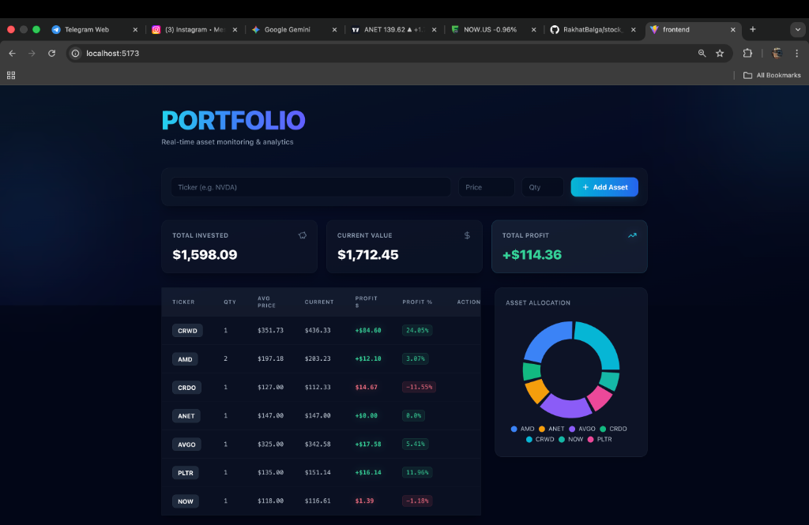
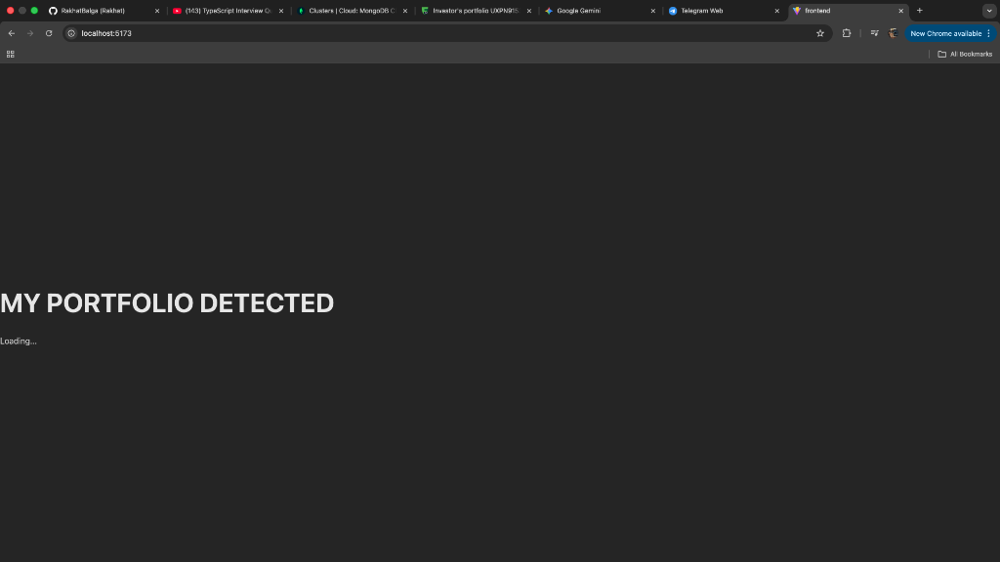

# 📈 Stock Portfolio Tracker

[](https://fastapi.tiangolo.com/) [](https://reactjs.org/) [](https://tailwindcss.com/) [](https://www.mongodb.com/) [](https://vitejs.dev/)

A modern, high-performance full-stack web application designed for real-time tracking of personal stock investments. Built with a focus on seamless user experience, responsive design, and robust asynchronous data processing.

<div align="center">
  
</div>

<br />

<div align="center">
  
</div>

## 🚀 Key Features & Capabilities

- **Real-Time Market Data Integration**: Asynchronously fetches live market quotes via the `yfinance` API, ensuring users always see up-to-date asset valuations.
- **Advanced Portfolio Analytics**: Dynamically calculates aggregated metrics including Total Capital Invested, Real-time Portfolio Value, and precise Profit/Loss margins (absolute and percentage-based).
- **Comprehensive Asset Management**: Full CRUD capabilities for individual stock transactions, managed efficiently through a RESTful FastAPI backend.
- **Intelligent Data Aggregation**: Automatically groups and averages multiple transactions of identical tickers to present a unified view of average cost basis and total holdings.
- **Modern, Reactive UI**: Features a sleek, responsive dark-mode interface built with Tailwind CSS v4, utilizing glassmorphism, micro-animations, and conditional typography for financial indicators.
- **Resilient Error Handling**: Implements graceful degradation mechanisms—if external financial APIs experience downtime or rate-limiting, the system intelligently falls back to historical purchase data safely.

## 🛠️ Technical Architecture

This project strictly adheres to a decoupled client-server architecture, ensuring scalability and maintainability.

### Backend Infrastructure

- **Core Framework**: Python / [FastAPI](https://fastapi.tiangolo.com/) – Chosen for its exceptional speed and native asynchronous support.
- **Database Architecture**: MongoDB Atlas utilized as a highly scalable NoSQL data store.
- **Data Validation & ODM**: Integrated `Beanie` and `Pydantic` for strict type enforcement, schema validation, and asynchronous MongoDB operations via `Motor`.

### Frontend Engineering

- **Library & State Management**: React (TypeScript/TSX) utilizing functional components, custom hooks, and optimized memoization.
- **Build System**: Vite – Providing rapid HMR (Hot Module Replacement) and highly optimized production builds.
- **Styling Architecture**: Tailwind CSS v4 for a utility-first, highly maintainable design system.
- **Network Layer**: Axios configured for intercepted and serialized RESTful communication.

## 📂 Project Structure

```text
finance_project/
├── backend/                  # Asynchronous FastAPI Service
│   ├── main.py               # REST Endpoints, CORS config, and Business Logic
│   ├── database.py           # MongoDB lifecycle management
│   └── models.py             # Beanie/Pydantic schemas
├── frontend/                 # React SPA (TypeScript)
│   ├── src/api/axios.ts      # Configured HTTP Client
│   ├── src/components/       # Reusable, stateless UI components
│   ├── src/modules/          # Stateful, domain-specific data modules
│   ├── src/pages/            # Top-level view orchestration
│   └── src/index.css         # Tailwind v4 directives and custom theme variables
```

## ⚙️ Local Development Setup

### Prerequisites

- Node.js (v18+)
- Python 3.9+
- MongoDB instance (Local or Atlas URI)

### 1. Backend Initialization

```bash
cd finance_project
python -m venv venv
source venv/bin/activate  # Windows: venv\\Scripts\\activate
pip install -r requirements.txt
pip install "fastapi[standard]"

# Configure Environment
echo "MONGO_URL=mongodb+srv://<user>:<password>@cluster/portfolio" > .env

# Launch Server (http://localhost:8000)
fastapi dev backend/main.py
```

### 2. Frontend Initialization

```bash
cd finance_project/frontend
npm install

# Launch Vite Development Server (http://localhost:5173)
npm run dev
```

## 👤 Developer

**Rakhat Balgabekov**

- [GitHub Profile](https://github.com/RakhatBalga)
